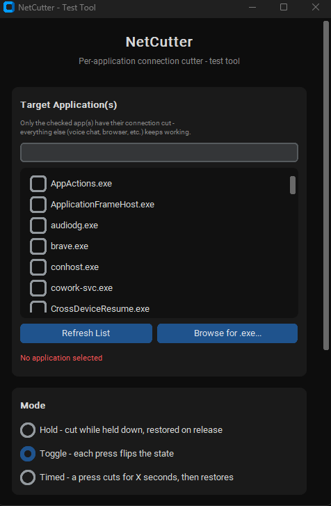
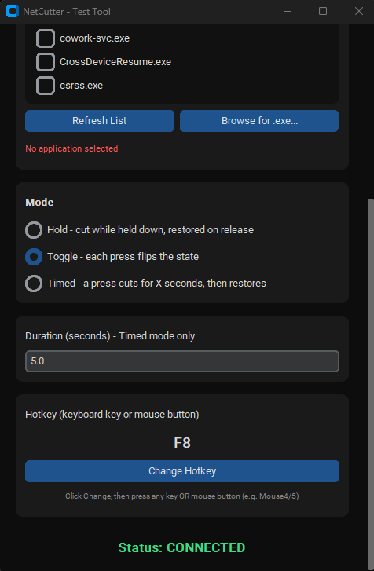

# NetCutter

A lightweight Windows utility for instantly cutting and restoring network access for one or more selected applications using a global hotkey. Built to test connection-loss handling and anti-lag-switch mechanics during game development.

## Overview

NetCutter blocks inbound and outbound traffic for specific target applications rather than disabling the entire network adapter. This means voice chat, browsers, and other background applications continue to work normally while only the selected application(s) lose connectivity.

The tool is intended for developers who need to reliably reproduce a sudden connection drop against their own application, for example to verify how a game client and server behave when a player's connection is cut mid-session, or to validate an anti-lag-switch detection system.

## Screenshots

<table>
  <tr>
    <td align="center"></td>
    <td align="center"></td>
  </tr>
  <tr>
    <td align="center">Target application selection</td>
    <td align="center">Mode, duration, and hotkey configuration</td>
  </tr>
</table>

<p align="center">
  <br>
  On-screen overlay showing the current state and elapsed cut duration
</p>

## Features

- **Per-application targeting**: select one or more running processes (listed the same way Task Manager would show them) or browse for an executable manually.
- **Search filtering**: filter the process list by name; selections are preserved even while filtered out of view.
- **Three trigger modes**:
  - **Hold** — connection is cut while the hotkey is held down and restored on release.
  - **Toggle** — each press flips the state between cut and restored.
  - **Timed** — a single press cuts the connection for a configurable duration (in seconds) and restores it automatically.
- **Custom hotkeys**: bind any keyboard key or mouse button as the trigger.
- **Global, low-latency response**: hotkeys are captured system-wide and work even when a target application is running in fullscreen.
- **On-screen overlay**: a small, draggable, always-on-top badge shows the current state (CUT / CONNECTED) along with a live stopwatch that starts when a cut begins and stops when connectivity is restored.
- **Instant rule application**: firewall rules are applied and removed directly through the Windows Firewall COM API rather than by shelling out to `netsh`, avoiding the latency of spawning external processes.
- **Dark, minimal interface** built with CustomTkinter.

## Requirements

- Windows 10 or later
- Python 3.9+
- Administrator privileges (required to modify Windows Firewall rules and to register a reliable global input hook)

## Installation

1. Clone this repository.
2. Install dependencies:

   ```
   pip install -r requirements.txt
   ```

3. Run the application:

   ```
   python main.py
   ```

   The application must be run as Administrator for the firewall rules and global hotkey to function correctly.

## Building a Standalone Executable

A build script is included to package the application as a single `.exe` using PyInstaller:

```
build.bat
```

This installs the required dependencies and produces `dist/NetCutter.exe`, which requests Administrator elevation automatically on launch.

## Usage

1. Launch NetCutter (as Administrator).
2. Under **Target Application(s)**, select one or more processes from the list, or use **Browse for .exe...** to add one manually.
3. Choose a mode: **Hold**, **Toggle**, or **Timed**. For Timed mode, set the cut duration in seconds.
4. Set a hotkey (keyboard key or mouse button) under **Hotkey**.
5. Trigger the hotkey to cut the selected application(s)' network access. The status label and overlay badge reflect the current state in real time.

## How It Works

NetCutter adds Windows Firewall rules scoped to each target application's executable path, blocking that program's inbound and outbound traffic without affecting the rest of the system. Rules are created and removed through the firewall's native COM interface (`HNetCfg.FwPolicy2`), which responds essentially instantly compared to invoking the `netsh` command-line tool as a subprocess.

## Scope and Intended Use

This tool is designed for controlled, local testing of an application's own resilience to connection loss, such as validating anti-lag-switch or disconnect-handling logic in a game or networked application that you own or have permission to test. It is not intended for use against third-party services, other players, or any system without explicit authorization.

## License

This project is licensed under the MIT License. See [LICENSE](LICENSE) for details.

## Special Thanks

Thanks to **memovic13** for his help during the testing and bug-fixing phase of this project.
